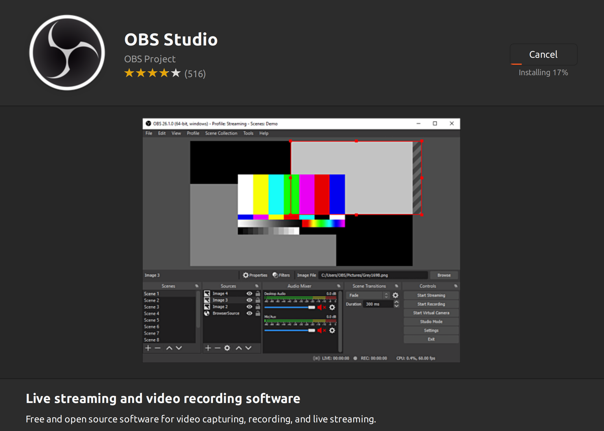
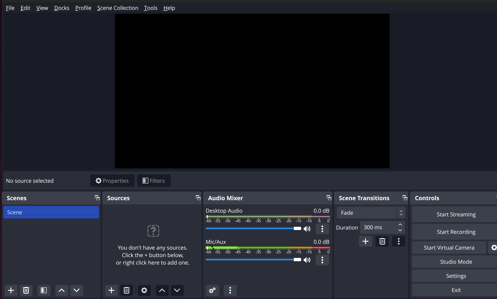

# Installing OBS Studio

[OBS Studio](https://obsproject.com/) is free and open source video recording and live-streaming software, available for Windows, Mac or Linux.

For Linux, it is officially distributed as a [Flatpak on Flathub](https://flathub.org/apps/details/com.obsproject.Studio) and a PPA for Ubuntu 20.04 and newer. For other installation methods and distros, including unofficial packages, click [here](https://obsproject.com/wiki/install-instructions#linux).

## Flatpak

Start her up and go through the wizard.

## First window

## Documentation

* [OBS Studio’s documentation](https://obsproject.com/docs/)
* [OBS Wiki](https://obsproject.com/wiki/Home)
* [Developing plugins for OBS](https://github.com/obsproject/obs-plugintemplate#obs-plugin-template)