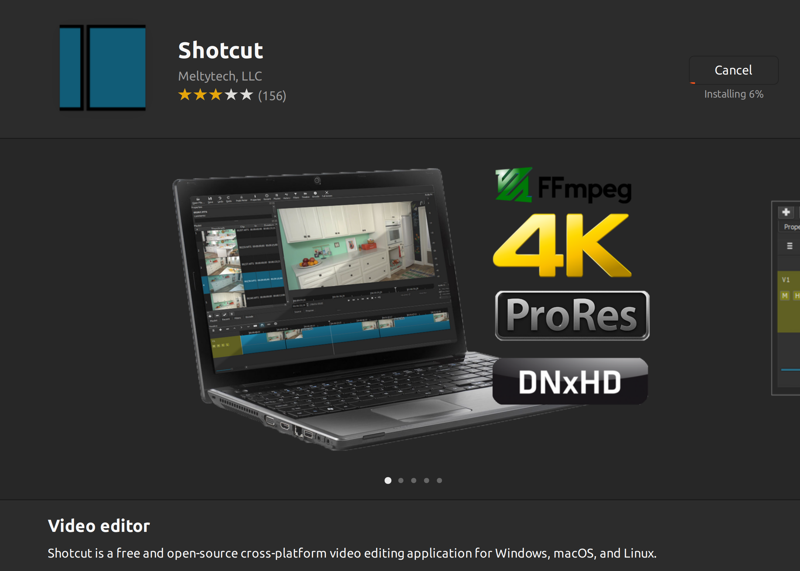
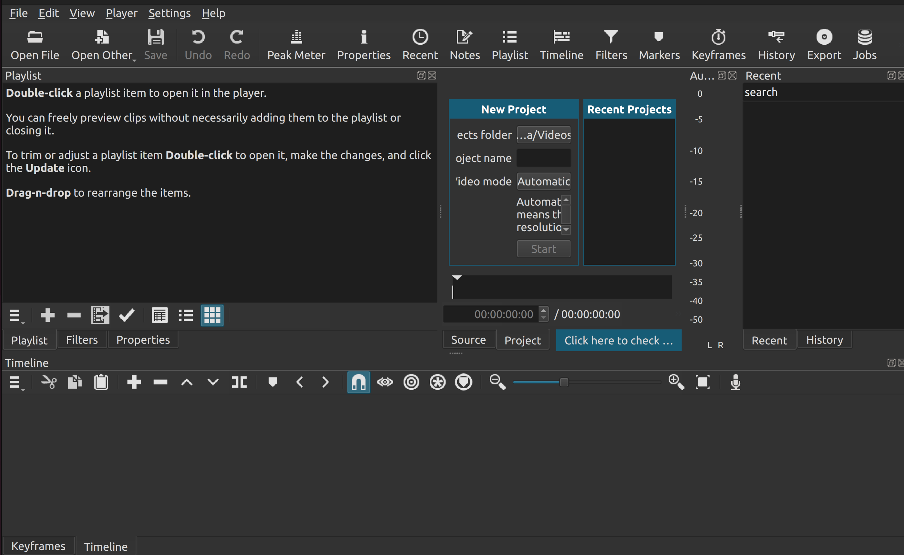

# Installing Shotcut

[Shotcut](https://www.shotcut.org/) is a free and open source video editor, compatible with Windows, macOS and Linux.

## Flatpak

Start her up and go through, the wizard.

## First window

## Documentation

* [Shotcut How To Articles](https://www.shotcut.org/howtos/)
