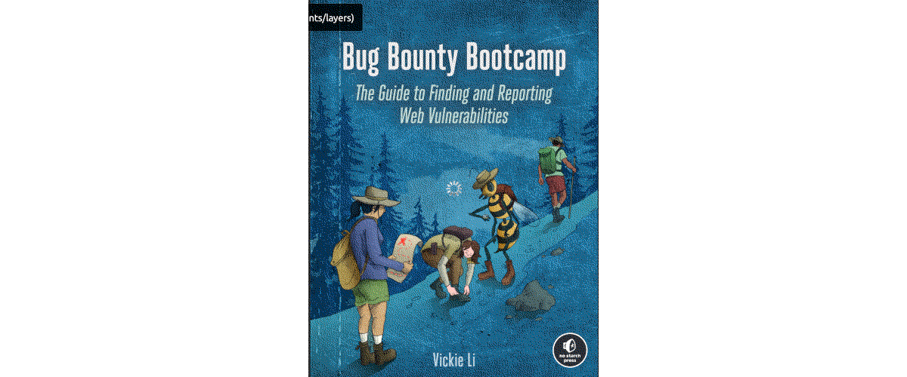

Bug bounty hunting
==============================================

Preparing for participation in bug bounty programs, crowd-sourced penetration testing programs that reward finding
security bugs and ways to exploit them. A great way to test skills on a variety of targets and get paid in case of
finding some security vulnerabilities.

----

----

.. toctree::
   :glob:
   :maxdepth: 1
   :includehidden:
   :caption: Industry

   docs/industry/README.md
   docs/industry/state.md
   docs/industry/assets.md
   docs/industry/platforms.md
   docs/industry/scope.md
   docs/industry/private.md

.. toctree::
   :glob:
   :maxdepth: 1
   :includehidden:
   :caption: Hello world

   docs/hello/README.md
   Kali VM <https://red.tymyrddin.dev/projects/bof/en/latest/docs/prep/kali.html>
   docs/hello/burp.md
   docs/hello/zap.md
   docs/hello/recon.md
   docs/hello/scripts.md

.. toctree::
   :glob:
   :maxdepth: 1
   :includehidden:
   :caption: Web vulnerabilities

   docs/vulns/README.md
   Cross-Site Scripting <https://red.tymyrddin.dev/projects/app/en/latest/docs/exploit/xss.html>
   Open Redirects <https://red.tymyrddin.dev/projects/app/en/latest/docs/exploit/redirects.html>
   Clickjacking <https://red.tymyrddin.dev/projects/app/en/latest/docs/exploit/clickjacking.html>
   Cross-Site Request Forgery <https://red.tymyrddin.dev/projects/app/en/latest/docs/exploit/csrf.html>
   Insecure Direct Object References <https://red.tymyrddin.dev/projects/app/en/latest/docs/exploit/idor.html>
   SQL Injection <https://red.tymyrddin.dev/projects/app/en/latest/docs/exploit/sql.html>
   Race conditions <https://red.tymyrddin.dev/projects/app/en/latest/docs/exploit/race.html>
   Local File Inclusion <https://red.tymyrddin.dev/projects/app/en/latest/docs/exploit/lfi.html>
   Server-Side Request Forgery <https://red.tymyrddin.dev/projects/app/en/latest/docs/exploit/ssrf.html>
   Insecure Deserialization <https://red.tymyrddin.dev/projects/app/en/latest/docs/exploit/id.html>
   XML External Entity <https://red.tymyrddin.dev/projects/app/en/latest/docs/exploit/xxe.html>
   Template injection <https://red.tymyrddin.dev/projects/app/en/latest/docs/exploit/ti.html>
   Application Logic Errors and Broken Access Control <https://red.tymyrddin.dev/projects/app/en/latest/docs/exploit/access.html>
   Remote Code Execution <https://red.tymyrddin.dev/projects/app/en/latest/docs/exploit/rce.html>
   Same-Origin Policy Vulnerabilities <https://red.tymyrddin.dev/projects/app/en/latest/docs/exploit/sop.html>
   Single-Sign-On Security Issues <https://red.tymyrddin.dev/projects/app/en/latest/docs/exploit/sso.html>
   Information Disclosure <https://red.tymyrddin.dev/projects/app/en/latest/docs/exploit/disclosure.html>

.. toctree::
   :glob:
   :maxdepth: 1
   :includehidden:
   :caption: Expert techniques

   docs/expert/README.md
   docs/expert/reviews.md
   docs/expert/android.md
   API Mayhem <https://red.tymyrddin.dev/projects/api/en/latest/>
   docs/expert/fuzzing.md

.. toctree::
   :caption: Links

   Blue Team <https://blue.tymyrddin.dev/>
