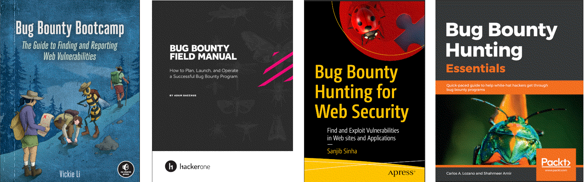

Bug bounty hunting
==============================================

Preparing for participation in `bug bounty programs <https://purple.tymyrddin.dev/en/latest/docs/bbh/README.html>`_, crowd-sourced penetration testing programs that reward finding
security bugs and ways to exploit them. A great way to test skills on a variety of targets and get paid in case of
finding some security vulnerabilities.

----

----

.. toctree::
   :maxdepth: 1
   :includehidden:
   :caption: Weaponisation

   docs/prep/README.md
   Install a Kali VM <https://red.tymyrddin.dev/projects/iac/en/latest/docs/lab/kali.html>
   Install a Windows VM <https://red.tymyrddin.dev/projects/iac/en/latest/docs/lab/windows.html>
   Setting up Burp Suite on Kali <https://red.tymyrddin.dev/projects/iac/en/latest/docs/lab/burp.html>
   Setting up ZAP on Kali <https://red.tymyrddin.dev/projects/iac/en/latest/docs/lab/zap.html>
   Installing Immunity Debugger on Windows <https://red.tymyrddin.dev/projects/iac/en/latest/docs/lab/immunity.html>

.. toctree::
   :glob:
   :maxdepth: 1
   :includehidden:
   :caption: Essentials

   docs/essentials/README.md
   docs/essentials/methodology.md
   docs/essentials/silent.md
   docs/essentials/report.md

.. toctree::
   :glob:
   :maxdepth: 1
   :includehidden:
   :caption: Screencasting PoCs

   docs/screencasting/README.md
   docs/screencasting/obs.md
   docs/screencasting/shotcut.md

.. toctree::
   :glob:
   :maxdepth: 1
   :includehidden:
   :caption: Assets to hunt in

   docs/assets/README.md
   Web application hacking <https://red.tymyrddin.dev/projects/api/en/latest/>
   Hacking APIs <https://red.tymyrddin.dev/projects/api/en/latest/>
   IoT hacking <https://red.tymyrddin.dev/projects/iot/en/latest/>
   Buffer overflow exploits <https://red.tymyrddin.dev/projects/bof/en/latest/>

.. toctree::
   :caption: Links

   Red Team <https://red.tymyrddin.dev/>
